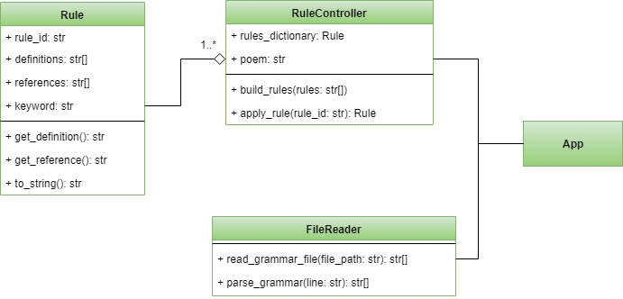

# poemgenerator


>Random poem generator that use a set of grammatical rules

## Usage

The file `app.py` is the executable of my solution to generate a random poem but is necessary specify the file path that contains the set of [grammatical rules](./grammaticalRules.txt) for its execution.

```python
rules = FileReader.read_grammar_file("grammaticalRules.txt")
```
after that you will receive a poem generated by those rules

```rain among sister runs beyond clear muddy
brother stands beneath white sister descends
willow with field
pasture beneath dark clear
sun walks your bright river before bright brother stands
```
## Class Diagram

This is the class diagram that describes the design used in my implementation for poem generator

